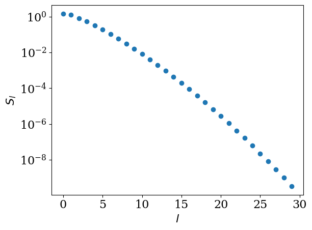
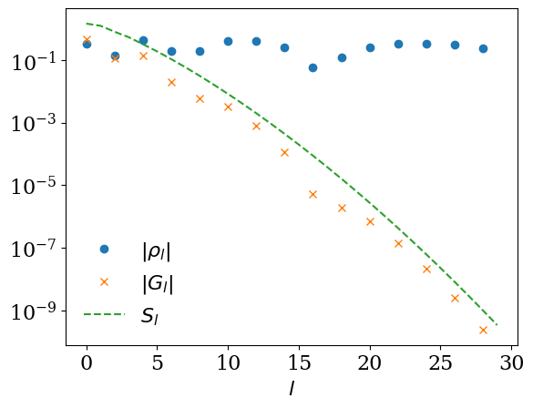

<!-- To show total number of pages for paginate = true -->

<!-- add center keyword for figure -->

$$
\newcommand{\iv}{{\mathrm{i}\nu}}
\newcommand{\ii}{{\mathrm{i}}}
\newcommand{\iw}{{\mathrm{i}\omega}}
\newcommand{\wmax}{{\omega_\mathrm{max}}}
\newcommand{\dd}{{\mathrm{d}}}
$$

虚時間グリーン関数に対するスパースモデリング入門
===

##### 品岡寛 (埼玉大学)

---
# 前提知識

* 虚時間形式グリーン関数の基礎
* Python or Juliaの基礎知識
   - 基本文法
   - 多次元配列
   - ...

---
# 何を学べるの？

* 虚時間グリーン関数のコンパクトな中間表現基底
  - $G(\tau) = \sum_{l=0}^{L-1} U_l(\tau) g_l + \epsilon$
  - $L\propto \log \beta W$ ($\beta$: inverse temperature, $W$: band width)
  - $\epsilon \propto \exp(-a L)$ ($\epsilon$: truncation error, $a>0$)
* 虚時間・虚周波数におけるスパースメッシュ: # of points $\simeq L$.
* SparseIR.jl (Julia), sparse-ir (Python)

---
# 参考資料

* 固体物理 2021年6月 [温度グリーン関数の情報圧縮に基づく高速量子多体計算法](https://shinaoka.sakura.ne.jp/data/kotai2021.pdf)
* $\uparrow$の英語訳・加筆 + 新ライブラリsparse-irに更新  [H. Shinaoka _et al._, SciPost Phys. Lect. Notes 63 (2022)](https://scipost.org/10.21468/SciPostPhysLectNotes.63)
* sparse-ir tutorials (大量のサンプルコード) [https://spm-lab.github.io/sparse-ir-tutorial/index.html](https://spm-lab.github.io/sparse-ir-tutorial/index.html)

---
# 概要

* Part I
  1. 虚時間グリーン関数の性質のまとめ
  2. 中間表現基底
  3. スパースサンプリング法
* Part II
  1. 開発環境のセットアップ
  

---
# Imaginary-time Green's functions

Also known as Matsubara Green's functions:

$$
G(\tau) = - \langle T_\tau A(\tau) B(0) \rangle,
$$

where
* $A(\tau)$, $B(\tau)$ are operators in the Heisenberg picture ($A(\tau) = e^{\tau H} A e^{-\tau H}$).
* $\langle \cdots \rangle = \mathrm{Tr}(e^{-\beta H} \cdots)$, where $\beta = 1/T$ ($k_\mathrm{B}=1$).

We use the Hamiltonian formalism throughout this lecture.

---
# Imaginary-time Green's functions

$$
G(\tau) = - \langle T_\tau A(\tau) B(0) \rangle
$$

* $A$ and $B$ are fermionic operators $\rightarrow$ $G(\tau) = -G(\tau+\beta)$
* $A$ and $B$ are bosonic operators $\rightarrow$ $G(\tau) = G(\tau+\beta)$

In general, $G(\tau)$ has a discontinuity at $\tau = n \beta$ ($n \in \mathbb{N}$).

---
# Imaginary-frequency (Matsubara) Green's functions

Matsubara Green's function:

$$
G(\mathrm{i}\omega) = \int_0^\beta \mathrm{d}\tau e^{\mathrm{i} \omega \tau} G(\tau).
$$

From $G(\tau+\beta) = \mp G(\tau)$,

*  $\omega = (2n+1) T\pi$ (fermion)
*  $\omega = 2n T \pi$ (boson)
  
($n \in \mathbb{N}$)

These discrete imaginary frequencies are denoted as Matsubara frequencies.

---
# Spectral/Lehmann representation

$$
G(z) = \int_{-\infty}^{+\infty} \mathrm{d}\omega' \frac{\rho(\omega')}{z - \omega'},
$$
where $\rho(\omega)$ is a spectral function.

* $z = \mathrm{i}\omega$ $\rightarrow$ Matsubara Green's function
* $z = \omega + \mathrm{i}0^+$ $\rightarrow$ Retarded Green's function (not used in this lecture)

---
# How Greeen's function look like in $\tau$?

Example (single pole): $\rho(\omega) = \delta(\omega - \omega_0)$, $\omega_0 > 0$

$$
G(\mathrm{i}\omega) = \frac{1}{\mathrm{i}\omega - \omega_0}
$$

$$
G(\tau) = - \frac{e^{-\tau\omega_0}}{1 + e^{-\beta\omega_0}}~(0 < \tau < \beta)
$$

At $\tau\approx 0$, $G(\tau) \propto e^{-\tau\omega_0}$.
For $\beta \omega_0 \gg 1$, coexisting two time scales : $1/\omega_0 \ll \beta$ 

---
# How Greeen's function look like in Matsubara frequency space

Example (single pole): $\rho(\omega) = \delta(\omega - \omega_0)$, $\omega_0 > 0$

$$
G(\mathrm{i}\omega) = \frac{1}{\mathrm{i}\omega - \omega_0}
$$

$$
G(\tau) = - \frac{e^{-\tau\omega_0}}{1 + e^{-\beta\omega_0}}~(0 < \tau < \beta)
$$

At high frequencies $|\omega| \gg |\omega_0|$, $G(\mathrm{i}\omega) \approx 1/(\mathrm{i}\omega)$.

For $\beta \omega_0 \gg 1$, coexisting two energy scales: $\omega_0 \ll T = 1/\beta$ 

---
# Difficulties in numerical simulations

If band width $W$ and temperature $T$ differ by orders of magnitudes as $\beta W \gg 1$:

* Slow power-law decay at high frequencies $\rightarrow$ Large truncation errors
* Uniform dense mesh in $\tau$ requires a huge number of points $\propto \beta W$.

Example:

* Band width 10 eV, superconducting temperature 1 K $\approx 0.1$ meV $\rightarrow$ $\beta W = 10^5$.

We need a compact basis with exponetial convergence.

---
# Compact representations

* **Intermediate represenation** (sparse-ir)
  - *Ab initio* calculations (Eliashberg theory, *GW*, Lichtenstein formula)
  - Diagrammatic calculations (FLEX)
* Discrete Lehmann representation (implemented in sparse-ir as well)
* Minmax method (from Kresse's group)

---
# Mathematical background: singular value decomposition (SVD)

Any complex-valued matrix $A$ of size $M \times N$ can be decomposed as

$$
A = U \Sigma V^\dagger,
$$

where
$$
U = (u_1, u_2, \cdots, u_{L}): M \times L,
$$
$$
V = (v_1, v_2, \cdots, v_{L}): N \times L,
$$
where $u_i^\dagger u_j = \delta_{ij}$, $v_i^\dagger v_j = \delta_{ij}$, $L = \mathrm{min}(M, N)$. $\Sigma$ is a diagonal matrix with non-negative diagonal elements $s_1 \ge s_2 \ge \cdots \ge s_L \ge 0$.

* Unique up to a phase if the singular values $s_i$ are non-degenerate.
* If $A$ is a real matrix, $U$ and $V$ are also real orthogonal matrices.

---
#  Intermediate representation
Shinaoka _et al._ (2017)

---
# Analytic continuation kernel

Fermion & boson:
$$
\begin{align}
    G(\iv) &= \int_{-\infty}^\infty \dd\omega \underbrace{\frac{1}{\iv - \omega}}_{\equiv K(\iv, \omega)} A(\omega)
\end{align}
$$

$K(\iv, \omega)$ is system independent and $A(\omega) = -\ii(G^R(\omega) - G^A(\omega))$.

---
# Analytic continuation kernel

$$
\begin{align}
    G(\tau) &= - \int_{-\infty}^\infty \dd\omega K(\tau, \omega) A(\omega),
\end{align}
$$

$$
\begin{align}
    K(\tau, \omega) &\equiv - \frac{1}{\beta} \sum_{\iv} e^{-\iv \tau} K(\iv, \omega) =
    \begin{cases}
        \frac{e^{-\tau\omega}}{1\textcolor{red}{+}e^{-\beta\omega}} & (\mathrm{fermion})\\
        \frac{e^{-\tau\omega}}{1\textcolor{red}{-}e^{-\beta\omega}} & (\mathrm{boson})
    \end{cases},
\end{align}
$$

where $0 < \tau < \beta$.

For bosons, $|K(\tau,\omega)| \rightarrow +\infty$ at $\omega\rightarrow 0$. We want to use the same kernel for fermion & boson. How?

---
# Logistic kernel

$$
\begin{equation}
    G(\tau)= - \int_{-\infty}^\infty\dd{\omega} K^\mathrm{L}(\tau,\omega) \rho(\omega),
\end{equation}
$$

where $K^\mathrm{L}(\tau, \omega)$ is the "logistic kernel" defined as

$$
K^\mathrm{L}(\tau, \omega) =  \frac{e^{-\tau\omega}}{1+e^{-\beta\omega}},
$$

and $\rho(\omega)$ is the modified spectral function

$$
\begin{align}
    \rho(\omega) &\equiv 
    \begin{cases}
        A(\omega) & (\mathrm{fermion}),\\
        \frac{A(\omega)}{\tanh(\beta \omega/2)} & (\mathrm{boson}).
    \end{cases}
\end{align}
$$

This trick has been widely used in the lattice QCD community for a long time. This was introduced into condensed matter physics in J. Kaye _et al._ (2022).

---
# Singular value expansion

We introduce an ultraviolet $0 < \wmax < \infty$ and a dimensionless parameter $\Lambda \equiv \wmax\beta$

Because $K^\mathrm{L} \in C^\infty$ and $\in L^2$:

$$
K^\mathrm{L}(\tau, \omega) = \sum_{l=0}^\infty U_l(\tau) S_l V_l(\omega),
$$

for $-\wmax \le \omega \le \wmax$ and $0 \le \tau \le \beta$.

Singular functions: $\int_{-\wmax}^\wmax \dd \omega V_l(\omega) V_{l'}(\omega) = \delta_{ll'}$ and $\int_{0}^\beta \dd \tau U_l(\tau) U_{l'}(\tau) = \delta_{ll'}$.

$\rightarrow$ ``Indermediate represetation`` basis functions

---
# Singular values 

$\beta=10$ and $\wmax = 10$ ($\Lambda = 10^2$):

* Exponential decay
* Number of relevant $S_l$ grows as $O(\log \Lambda)$ (only numerical evidence)

---
# Basis functions

* Even/odd functions for even/odd $l$
* $l$ roots
* Only numerical expressions

---

# Basis functions in Matsubara frequency

$$
U_l(\iv) \equiv \int_0^\beta \dd \tau e^{\iv \tau} U_l(\tau).
$$

Fourier transform can be done numerically.

---
# Expansion in IR

$$
G(\tau) = \sum_{l=0}^{L-1} G_l U_l(\tau) + \epsilon_L,
$$

$$
\hat{G}(\mathrm{i}\nu) = \sum_{l=0}^{L-1} G_l \hat{U}_l(\mathrm{i}\nu) + \hat{\epsilon}_L,
$$

where $\epsilon_L,~\hat{\epsilon}_L \approx S_L$. The expansion coefficients $G_l$ can be determined from the spectral function as 

$$
G_l = -S_l \rho_l,
$$

where

$$
\rho_l = \int_{-\omega_\mathrm{max}}^{\omega_\mathrm{max}} \mathrm{d} \omega \rho(\omega) V_l(\omega).
$$

---
# Convergence

If $|\rho_l|$ is bounded from above, $|G_l|$ converges as fast as $S_l$ (system independent).

For  $\rho(\omega) = \frac{1}{2} (\delta(\omega-1) + \delta(\omega+1))$ (fermion),

$$
\rho_l = \int_{-\omega_\mathrm{max}}^{\omega_\mathrm{max}} \mathrm{d} \omega \rho(\omega) V_l(\omega) = \frac{1}{2}(V_l(1) + V_l(-1)).
$$

---
# Note: Connection to numerical analytic continuation

---
# Sparse meshes in frequency and time domains

---
# Numerical Fourier transform

---
# Implementation of Dyson equation

---
# Implementation of second-order perturbation theory

---
# Related technologies

* Minmax
* Discrete Lehmann reprensetation