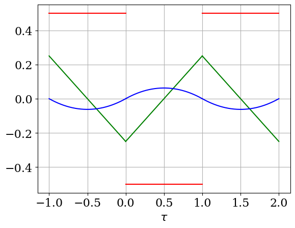

<!-- To show total number of pages for paginate = true -->
<style>
section::after {
  content: attr(data-marpit-pagination) '/' attr(data-marpit-pagination-total);
}
</style>

<!-- add center keyword for figure -->
<style>
img[alt~="center"] {
  display: block;
  margin: 0 auto;
}
</style>

$$
\newcommand{\iv}{{\mathrm{i}\nu}}
\newcommand{\iwk}{{\mathrm{i}\bar{\omega}_k}}
\newcommand{\ivk}{{\mathrm{i}\bar{\nu}_k}}
\newcommand{\tauk}{\bar{\tau_k}}
\newcommand{\ii}{{\mathrm{i}}}
\newcommand{\iw}{{\mathrm{i}\omega}}
\newcommand{\wmax}{{\omega_\mathrm{max}}}
\newcommand{\dd}{{\mathrm{d}}}
\newcommand{\tauk}{{\bar{\tau}_k}}
\newcommand{\wk}{{\bar{\omega}_k}}
\newcommand{\vk}{{\bar{\nu}_k}}
\newcommand{\hatFmat}{\hat{\mathbf{F}}}
\newcommand{\Fmat}{{\mathbf{F}}}
$$

虚時間グリーン関数に対するスパースモデリング入門(2)
===

##### 品岡寛 (埼玉大学)


---
# Part II: Exercise


---
# 前置き

* 共通の環境を使うため、Google Colabを使います。
* 簡単のためフェルミオンに限ります。


---
# 最初の目標

1. 松原グリーン関数を計算してみよう
2. 松原和を密なメッシュで計算してみる
3. 松原和を素なメッシュで計算してみる

---
# Matsubara frequency summation

In many situations, one needs to evaluate
$$
a = T \sum_n G(\iw_n),
$$
where $G(\iw_n)$ is a Green's function object.

---
# Fermi-Dirac distribution

$$
\begin{cases}
\rho(\omega) &= \delta(\omega - \omega_0),\\
G(\iw) &= \frac{1}{\iw - \omega_0}.
\end{cases}
$$

Electron occupation:
$$
\begin{align}
n &\equiv \langle c^\dagger c\rangle =  - \langle T c(0^-) c^\dagger(0) \rangle \\
&= G(\tau=0^-) = - \frac{1}{\beta} \sum_{n}  e^{\iw_n 0^+} G(\iw_n) = \frac{1}{1 + e^{\beta \omega_0}}.
\end{align}
$$

Here, we used

$$
G(\tau) \equiv - \langle T_\tau c(\tau) c^\dagger(0) \rangle =  - \frac{1}{\beta}\sum_n e^{-\iw\tau} G(\iw).
$$

<!--
Matsubara sum converges slowly as $O(1/N)$:cry:. Let us make it exponential!
-->


---
# Note on treatment of discontinuity



[Section B.3 of Emanuel Gull's Ph. D thesis](https://www.research-collection.ethz.ch/handle/20.500.11850/104013):
$$
\begin{align}
\frac{1}{\iw} &\leftrightarrow -\frac{1}{2}\\
\left(\frac{1}{\iw}\right)^2 &\leftrightarrow \frac{1}{4}(-\beta + 2\tau)\\
\left(\frac{1}{\iw}\right)^3 &\leftrightarrow \frac{1}{4}(\beta\tau -\tau^2)\\
\end{align}
$$
for $0 < \tau < \beta$.  The proof is straightforward for the $\leftarrow$ direction.


---
# Conventional approach for Matsubara summation

$$
\tilde{G}(\iw) \equiv G(\iw) - \frac{1}{\iw} \propto O((1/\iw)^2)
$$

$\because$ $\tilde{G}(\tau)$ is continuous at $\tau=0$,

$$
\begin{align}
n &= G(\tau=0^-)\\
 & = \tilde G(\tau=0) + G_\mathrm{tail}(\tau=0^-)\\
 &= \tilde G(\tau=0) - G_\mathrm{tail}(\tau=\beta+0^-)\\
 &= \frac{1}{\beta} \sum_{n=-N}^{N-1}  \tilde{G}(\iw_n) + \frac{1}{2},
\end{align}
$$
where $G_\mathrm{tail}(\iw) = 1/\iw$. The truncation error in the first term converges only as $O(1/N)$ :cry:.

---
# Exercise1: Naive Matsubara summation

1. Open [Notebook on Google Colab](https://colab.research.google.com/drive/13g3wYpVAV5wCxifX2Zj6h_4u29Xn1ncJ?usp=sharing)
2. Copy the notebook and run it!


---
# Matsubara summation using sparse sampling


---
# IR basis + sparse sampling

$$
\begin{cases}
G(\tau) &= \sum_l G_l U_l(\tau),\\
G(\iw) &= \sum_l G_l U_l(\iw),\\
\end{cases}
$$

$$
\begin{align}
n &= G(\tau=0^-) = - \sum_{l=0}^\infty U_l(\tau=\beta) G_l
\end{align}
$$

The convergence $n$ is exponential $\because$ exponential convergence of $G_l$.
We can determine $G_l$ from $G(\iwk)$ on the sampling frequencies!

$$
G(\iwk) \rightarrow G_l \rightarrow n
$$

---
# Exercise2: Matsubara summation by sparse sampling

1. Open [Notebook on Google Colab](https://colab.research.google.com/drive/1vh0_HXStYBroz2qd89H3tcZIxlXYGV9i?usp=sharing)
2. Copy the notebook and run it!

Check!
* How does the error in $N$ decay as cutoff for singular values $\epsilon$ is decreased?
* (Advanced) More complicated spectral model (e.g., many poles)


<!--
---
# Preparation

### Python (sparse-ir)

* Google Colab (maybe fast)
* [binder](https://mybinder.org/v2/gh/SpM-lab/sparse-ir-binder/HEAD)

### Julia (SparseIR.jl)

* Your own environment (JupyterLab, VS Code...)
* [binder](https://mybinder.org/v2/gh/SpM-lab/sparse-ir-binder/HEAD)


---
# Python: Google Colab

* Notebook1 
* 

---
# Julia

1. Check if your notebook environment works without `SparseIR.jl`.

2. Install dependencies for running notebooks as follows:

```Julia
using Pkg
Pkg.add(["Plots", "FFTW", "FastGaussQuadrature", "LaTeXStrings", "SparseIR"])
```


---
# Numerical examples

We will run the notebooks in the second part of this lecture!


---
# Related technologies

* Minmax
* Discrete Lehmann reprensetation
-->